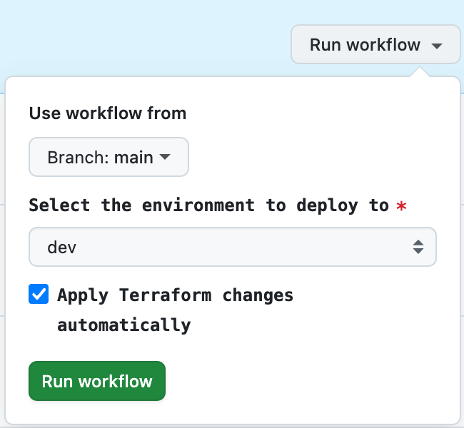

# Launchplate React

A React application deployed to AWS using Terraform with multiple environment support.

- **Frontend**: React **static** **SPA** hosted on S3 and distributed via CloudFront
- **DNS**: Managed by either **CloudFlare** or **Route53** (environment-dependent)
- **Optional Features**: S3 buckets encryption (disabled by default), WAF protection (disabled by default)
- **SSL Certificates**: AWS ACM with DNS validation
- **Redirect from root to www**: Enabled by default when using Cloudflare, based on Page Rules. This feature isn't supported when using Route53.

```
├── .github/
│   ├── actions/          # Custom GitHub Actions
│   └── workflows/        # GitHub Actions workflows
├── terraform/
│   ├── live              # Workspace-CLI environments
│   ├── modules/          # Reusable Terraform modules
│   └── bootstrap/        # Bootstrap shared TF state
└── web/                      # React application source code
```

Make a table with three rows (production, staging, development) with two columns (root url redirected to www, www url)

| Environment | Root URL (redirected to www) | WWW URL |
|-------------|---------------------------|---------|
| Production  | [launchplate-react.gloweet.com](https://launchplate-react.gloweet.com)                       | [www.launchplate-react.gloweet.com](https://www.launchplate-react.gloweet.com) |
| Staging     | [stg-launchplate-react.gloweet.com](https://stg-launchplate-react.gloweet.com)                       | [www.stg-launchplate-react.gloweet.com](https://www.stg-launchplate-react.gloweet.com) |
| Development | [dev-launchplate-react.gloweet.com](https://dev-launchplate-react.gloweet.com)                       | [www.dev-launchplate-react.gloweet.com](https://www.dev-launchplate-react.gloweet.com) |

## Documentation
- [Infrastructure and CI/CD pipeline setup](/terraform/README.md)
- [Use pre-commit](/docs/pre-commit.md)

## Development Setup

1. **Prerequisites**

   - Node.js 20+
   - pnpm 10+
   - AWS CLI configured
   - Terraform CLI 1.12+

2. **Install dependencies**

   ```bash
   pnpm install
   ```

3. **Run locally**

   ```bash
   pnpm dev
   ```

4. **Run tests**

   ```bash
   pnpm test
   ```

5. **Build for specific environment**
   ```bash
   pnpm build:qa      # Build for QA
   pnpm build:staging # Build for Staging
   pnpm build:production  # Build for Production
   ```

## Infrastructure Management

### Working with Terraform Workspaces

This project uses Terraform Workspaces to manage multiple environments (qa, staging, production).

```bash
cd terraform/live
# Initialize Terraform
terraform init

# Initialize Workspaces
terraform workspace new dev
terraform workspace new stg
terraform workspace new prod
terraform workspace list

terraform workspace select dev

# Plan changes
terraform plan

# Apply changes
terraform apply
```

### Pushing website to S3

To push the build website to S3, run the following command:

```bash
cd web
pnpm build:prod
pnpm aws:sync:prod
```

### How to use the CI/CD Workflow

#### **Manual Deployment with Approval**

1. Trigger workflow_dispatch with `auto_apply = false`

   To do that, go to the Actions tab in your GitHub repository, select the workflow you want to trigger, and click on the "Run workflow" button on the top right corner.
   
2. The workflow creates a GitHub issue with the Terraform plan
3. Review the plan in the issue
4. Comment `/apply` on the issue to approve
5. Only members of the `terraform-approvers` team can approve
6. The workflow will detect the comment and apply the changes using the correct environment

#### **Automatic Deployment**

For automated deployments, you can:
- Push to development/staging branches (applies automatically)
- Use workflow_dispatch with `auto_apply = true`

#### **Pull Request Flow**

For PRs:
1. The workflow runs and comments the plan on the PR
2. Review the plan in the PR comments
3. Comment `/apply` to approve
4. Only members of the `terraform-approvers` team can approve

This implementation addresses both issues you identified while maintaining a clean, understandable workflow structure.
